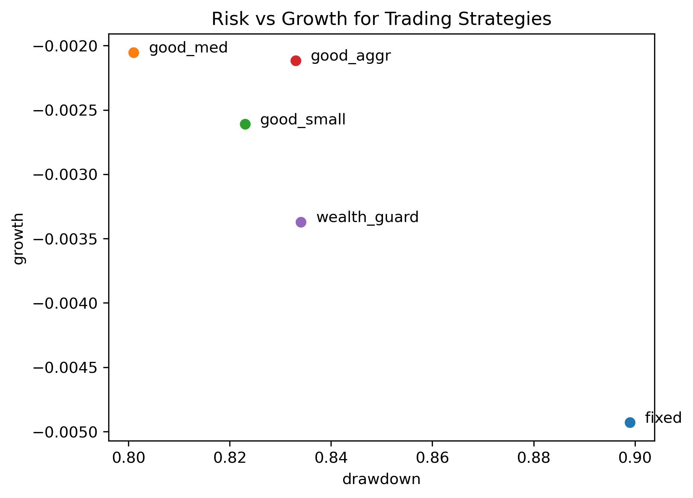
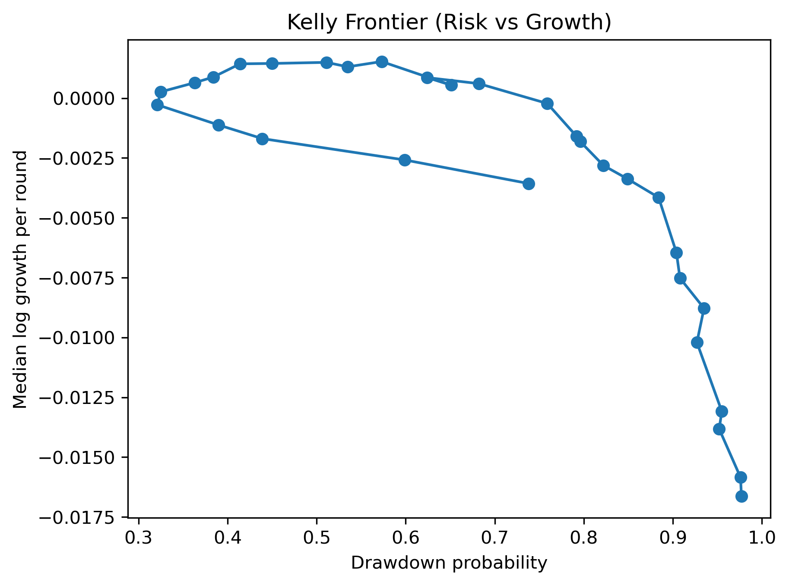

# Kelly Betting Under Regime-Switching Markets

A Monte Carlo simulation exploring Kelly-style trading strategies under crash risk and regime-switching market conditions. 

Starting from a simple fixed-edge betting model, I extended the simulation to include:

- rare crash events
- regime-switching market conditions
- noisy signals about the current regime

I then compared several trading strategies based on long-run growth and drawdown risk. 

## Main ideas explored

- Kelly criterion under a fixed edge
- how crash risk changes optimal bet sizing
- regime-switching markets with good / neutral / bad states
- imperfect information about the current regime
- strategy comparison using growth vs drawdown

## Example results

### Strategy Risk vs Growth

### Kelly frontier (Risk vs Growth)

## Tools used

- Python
- NumPy
- Matplotlib
- Monte Carlo simulation

## Running the project
The full simulation and analysis can be found in:
'kelly_regime_simulation.ipynb'

